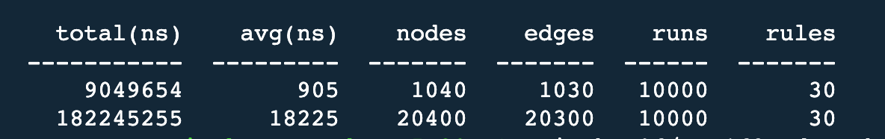

# power-supply-system-model-lint

[](http://commitizen.github.io/cz-cli/)

## Purpose

* 对供电系统模型进行合法性校验
* 提供命令行工具和python api两种使用方式
* 本项目仅为框架， 具体校验规则需要通过插件实现

## A sample application

[sample](./tests/test_linter.py)

## Development & Test

Install [rye](https://rye-up.com/guide/installation/), then:

```bash
rye sync
pytest
```

## Benchmark


